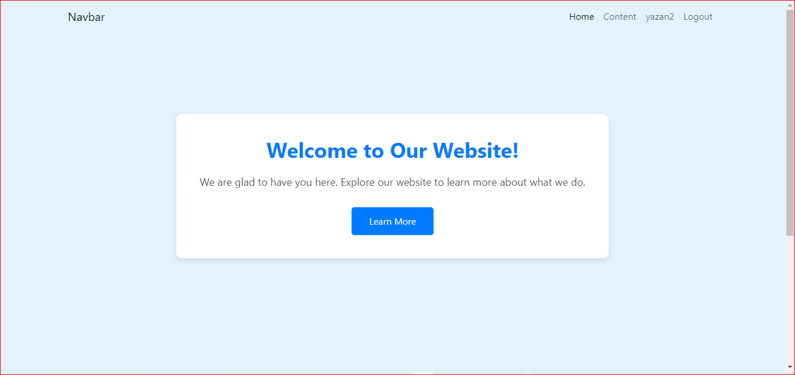

# React + Vite

This template provides a minimal setup to get React working in Vite with HMR and some ESLint rules.
and work the project without context(prop drilling)
# About project
in this project i use :
- react vite
- use hooks(useState,useEffect,useNavigation)
- auth(Jwt) in the signin ,signup
- way of send variable between component(prop deilling NOT CONTEXT)
- simple routing (SPA)
- connect(signup and signin) with DB(API)
- signout
- use localStorage to store token

# Befor Login

# After Login
